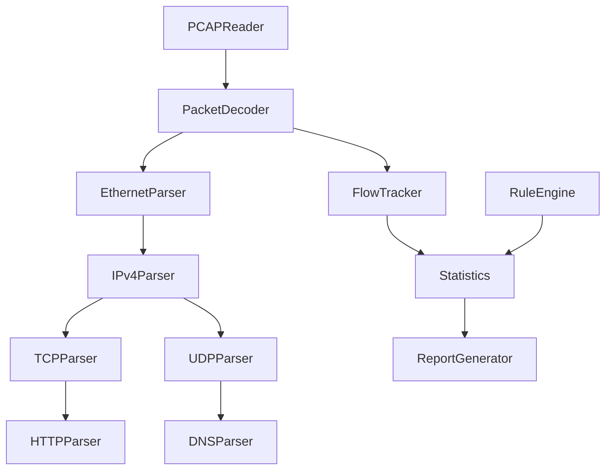

# Project 3 — Offline Deep Packet Inspection (DPI) / PCAP Analyzer

---

# 1. Development Roadmap

## Phase 1 — Project Setup

### Objectives

- Configure CMake
- Setup GitHub Actions
- Add GoogleTest
- Add Google Benchmark
- Configure compiler warnings
- Create project skeleton

### Deliverables

- Debug & Release builds
- CLI application
- Test executable
- Benchmark executable

---

## Phase 2 — PCAP Reader

### Implement

- PCAP file parser
- Global header validation
- Packet header parser
- Streaming packet reader
- Endianness handling
- Error reporting

### Verification

- Read valid captures
- Detect invalid headers
- Handle truncated files
- Support large captures (>1GB)

---

## Phase 3 — Protocol Parsers

### Layer 2

- Ethernet II
- VLAN (optional)

### Layer 3

- IPv4
- ICMP
- IPv6 (optional)

### Layer 4

- TCP
- UDP

### Layer 7

- HTTP
- DNS
- TLS Detection
- FTP Detection
- SMTP Detection

### Verification

- Decode known captures
- Validate header fields
- Skip malformed packets
- Detect unsupported protocols

---

## Phase 4 — Flow Tracking

### Implement

- Flow creation
- Flow lookup
- Flow update
- Flow expiration
- Flow statistics

Flow Key

```
Source IP
Destination IP
Source Port
Destination Port
Protocol
```

Track

- Packet count
- Byte count
- Duration
- First packet
- Last packet

Verification

- Correct flow grouping
- Accurate byte counts
- Timeout handling

---

## Phase 5 — Analysis Engine

### Statistics

Generate

- Total packets
- Total bytes
- Average packet size
- Protocol distribution
- Top IPs
- Top Ports
- Top Conversations
- Flow statistics

### Rule Engine

Implement rules

- HTTP traffic
- DNS traffic
- TLS traffic
- Unknown protocol
- Large transfer
- High packet count
- Suspicious ports

### Verification

- Correct statistics
- Rule matching
- Alert generation

---

## Phase 6 — Reporting

### Console

Display

- Capture summary
- Protocol counts
- Top IPs
- Top Ports
- Flow summary

### Export

Formats

- CSV
- JSON

Requirements

- Structured output
- Human readable
- Machine readable
- Large report support

---

## Phase 7 — Optimization

Improve

- Parsing speed
- Flow lookup
- Rule matching
- Memory usage
- Report generation

Profile

- perf
- Valgrind
- Callgrind
- Heaptrack

---

# 2. Dependency Graph



---

# 3. Benchmarks

## Parsing

Measure

- Packets/sec
- MB/sec
- CPU utilization
- Memory usage

Datasets

```
10 MB

100 MB

1 GB

10 GB
```

---

## Protocol Parsing

Measure

- Ethernet
- IPv4
- TCP
- UDP
- HTTP
- DNS

Metrics

- Decode time
- Validation time
- Error handling overhead

---

## Flow Tracking

Measure

- Flow insert/sec
- Flow lookup/sec
- Flow expiration
- Memory consumption

Datasets

```
1K flows

10K flows

100K flows

1M flows
```

---

## Reporting

Measure

- JSON export
- CSV export
- Console generation
- Serialization speed

---

# 4. Testing Strategy

## Unit Tests

- PCAP Reader
- Ethernet Parser
- IPv4 Parser
- TCP Parser
- UDP Parser
- HTTP Parser
- DNS Parser
- Flow Tracker
- Rule Engine
- Statistics
- Report Generator

Coverage Goal

> 90%

---

## Integration Tests

- Parse complete captures
- HTTP sessions
- DNS queries
- Mixed traffic
- Large captures
- Export reports

---

## Stress Tests

- 10GB capture
- Millions of packets
- Millions of flows
- Thousands of malformed packets
- Long-running analysis

---

## Failure Tests

- Corrupted PCAP
- Invalid packet lengths
- Unsupported EtherType
- Invalid IP header
- Invalid TCP header
- Corrupted DNS
- Corrupted HTTP
- Truncated payload

---

# 5. Coding Standards

General

- C++20/23
- RAII
- Const correctness
- `constexpr`
- `noexcept`
- Exception-safe APIs

Naming

```
ClassName

function_name()

variable_name

m_member

kConstant

ENUM_VALUE
```

Rules

- One parser per protocol
- Small cohesive classes
- No duplicated parsing logic
- Clear separation between decoding and analysis
- Prefer STL containers and algorithms

---

# 6. Performance Guidelines

Complexities

| Operation | Target |
|-----------|--------|
| Packet Parse | O(1) |
| Flow Lookup | O(1) |
| Flow Insert | O(1) |
| Statistics Update | O(1) |
| Rule Match | O(1)-O(n rules) |

Optimization Goals

- Stream packets (no full-file loading)
- Zero-copy payload access using `std::span`
- Minimize allocations
- Reserve container capacity
- Cache frequently used values
- Fast protocol dispatch

---

# 7. Security & Reliability

Protect Against

- Invalid file formats
- Buffer over-read
- Integer overflow
- Malformed packets
- Corrupted captures

Requirements

- Validate every header
- Check all lengths before reading
- Never trust packet data
- Continue after recoverable errors
- Prevent undefined behavior

---

# 8. Documentation

Repository must include

```
README

Architecture

Protocol Support

API Reference

Examples

Benchmarks

Rule Engine Guide

PCAP Format Notes
```

Every public API documents

- Purpose
- Parameters
- Return value
- Complexity
- Exceptions

---

# 9. CI/CD

GitHub Actions Pipeline

```text
Checkout

↓

Configure

↓

Build

↓

Unit Tests

↓

Sanitizers

↓

Benchmarks

↓

Package
```

Compilers

- GCC
- Clang

Configurations

- Debug
- Release

Sanitizers

- AddressSanitizer
- UndefinedBehaviorSanitizer
- ThreadSanitizer (future parallel version)

---

# 10. Definition of Done

PCAP

- Reads valid PCAP files
- Detects invalid captures
- Streams large files

Protocols

- Ethernet
- IPv4
- TCP
- UDP
- HTTP
- DNS
- TLS detection

Analysis

- Flow reconstruction
- Protocol statistics
- Top IPs
- Top Ports
- Rule engine
- Reports

Quality

- Unit tests pass
- Benchmarks completed
- No memory leaks
- No undefined behavior
- Documentation complete

---

# 11. Stretch Goals

- IPv6 support
- ARP
- DHCP
- ICMPv6
- TLS handshake parser
- HTTP/2 parser
- QUIC parser
- HTTP/3 support
- Plugin-based protocol architecture
- Live packet capture (libpcap)
- Signature-based IDS
- Malware detection
- Flow visualization
- HTML reports
- Multi-threaded packet processing
- eBPF integration

---

# 12. AI Implementation Instructions (Codex / Claude Code)

## General Rules

- Generate production-quality C++20/23 code only.
- Do not generate placeholder implementations.
- Separate headers and source files.
- Keep protocol parsers independent and modular.
- Use RAII exclusively.
- Avoid global mutable state.
- Stream packets instead of loading entire captures into memory.
- Validate all packet boundaries before accessing data.
- Use `std::span`, `std::string_view`, and standard library facilities wherever appropriate.
- Ensure malformed packets cannot crash the analyzer.
- Keep parsing, analysis, and reporting as separate modules.

## Code Quality

- Compile cleanly with `-Wall -Wextra -Wpedantic -Werror`.
- Pass `clang-tidy`.
- Pass AddressSanitizer and UndefinedBehaviorSanitizer.
- No memory leaks or undefined behavior.

## Performance Expectations

- Target >1M packets/sec on modern hardware.
- Avoid unnecessary packet copies.
- Reuse parsing buffers where possible.
- Use `unordered_map` for flow lookup.
- Process packets in a single streaming pass.

## Deliverables

- CMake project
- CLI analyzer
- Modular protocol parser library
- Unit tests
- Benchmarks
- Documentation
- Example PCAP files
- Example reports
- GitHub Actions workflow

---

**End of Project 3 Specification**