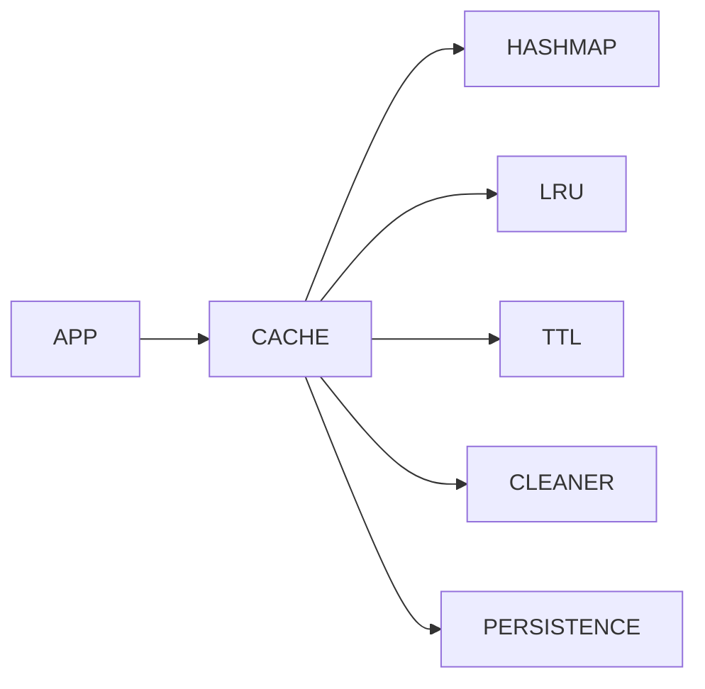

# Project 2 — Concurrent In-Memory Cache

> **Language:** C++20/23
> **Build:** CMake
> **Platform:** Linux (Primary), Windows (Secondary)
> **Type:** Thread-safe Library + CLI Demo
> **Target:** Mini Redis-like in-memory cache supporting TTL, LRU eviction, persistence, and concurrent access.

---

# 1. Overview

A high-performance concurrent key-value cache designed for backend services. The project focuses on correctness, low latency, modular architecture, and clean API design.

The project consists of:

- Cache Library (`libcache`)
- CLI Demo
- Benchmark Suite
- Unit Tests

---

# 2. Goals

- Thread-safe
- Low latency
- O(1) average lookup
- TTL expiration
- LRU eviction
- Persistence
- Background cleanup
- Generic value support
- Modular design
- Production-quality code

---

# 3. Features

## Core

- SET
- GET
- DELETE
- EXISTS
- CLEAR
- SIZE
- EMPTY

## Advanced

- TTL
- Expiration
- LRU Eviction
- Capacity Limit
- Background Cleanup Thread
- Save Snapshot
- Load Snapshot
- Statistics
- Configuration
- Thread-safe API

---

# 4. Non Goals

- Distributed cache
- Replication
- Networking
- Authentication
- Compression
- Transactions
- Cluster mode

---

# 5. Technology Stack

| Component | Technology |
|-----------|------------|
| Language | C++20/23 |
| Build | CMake |
| Tests | GoogleTest |
| Benchmark | Google Benchmark |
| Serialization | JSON/Binary |
| Threading | std::thread |
| Containers | STL |
| Filesystem | std::filesystem |

---

# 6. Directory Structure

```text
cache/

├── CMakeLists.txt
├── README.md

├── include/
│   └── cache/
│       ├── cache.hpp
│       ├── entry.hpp
│       ├── lru.hpp
│       ├── ttl.hpp
│       ├── persistence.hpp
│       ├── config.hpp
│       └── statistics.hpp

├── src/
│   ├── cache.cpp
│   ├── lru.cpp
│   ├── ttl.cpp
│   ├── persistence.cpp
│   ├── cleanup.cpp
│   └── config.cpp

├── apps/
│   └── cache_demo.cpp

├── tests/

├── benchmarks/

└── docs/
```

---

# 7. High-Level Architecture



---

# 8. Data Flow

```mermaid
flowchart LR

Client

--> API

--> Cache

--> Validation

--> HashMap

--> LRU Update

--> Response
```

---

# 9. Core Components

## Cache

Responsibilities

- Public API
- Thread safety
- Capacity management
- Statistics
- Persistence coordination

Public API

```cpp
set()

get()

erase()

exists()

clear()

size()

empty()

save()

load()
```

---

## CacheEntry

Contains

```cpp
Key

Value

TTL

Created Time

Last Access

Expiration Time
```

---

## Hash Map

Responsibilities

- O(1) lookup
- Store entries
- Key ownership
- Fast insert/remove

Container

```cpp
std::unordered_map
```

---

## LRU Manager

Responsibilities

- Track access order
- Update recently used
- Remove oldest
- Capacity eviction

Container

```
std::list

+

unordered_map iterator
```

Operations

```
touch()

remove()

evict()

insert()
```

---

## TTL Manager

Responsibilities

- Detect expiration
- Remove expired keys
- Update TTL
- Refresh expiration

Operations

```
set_ttl()

expired()

remove_expired()
```

---

## Cleanup Thread

Dedicated background worker

Responsibilities

- Scan expired keys
- Remove stale entries
- Update statistics

Runs periodically.

---

## Persistence

Responsibilities

- Save snapshot
- Load snapshot
- Validate data
- Recover state

Formats

- JSON
- Binary

---

## Statistics

Tracks

```
Hits

Misses

Hit Rate

Evictions

Expired Keys

Memory Usage

Entry Count
```

---

# 10. Internal Data Structures

```text
unordered_map<Key, Entry>

↓

Entry

↓

LRU Node

↓

TTL Metadata
```

---

# 11. Thread Model

```mermaid
flowchart LR

Reader1 --> Shared Mutex

Reader2 --> Shared Mutex

Writer --> Unique Mutex

Cleanup --> Unique Mutex

Persistence --> Shared Mutex
```

Rules

- Multiple concurrent readers
- Single writer
- Cleanup synchronized
- Persistence snapshot is consistent

Synchronization

```
std::shared_mutex

std::mutex

std::condition_variable

std::atomic
```

---

# 12. Memory Ownership

| Object | Owner |
|---------|------|
| Cache | Application |
| Entries | Cache |
| LRU Nodes | Cache |
| Cleanup Thread | Cache |
| Statistics | Cache |

Guidelines

- RAII only
- No owning raw pointers
- `std::unique_ptr` preferred
- Avoid unnecessary heap allocations

---

# 13. Configuration

Example

```json
{
    "capacity":100000,
    "cleanup_interval":5,
    "default_ttl":300,
    "persistence":"snapshot.bin",
    "auto_save":true
}
```

Runtime configurable

- Capacity
- Default TTL
- Cleanup interval
- Persistence path
- Auto save

---

# 14. CLI Demo

Examples

```bash
cache_demo

SET user 123

GET user

DELETE user

SIZE

SAVE snapshot.bin

LOAD snapshot.bin

STATS
```

---

# 15. Performance Targets

Cache

- O(1) average lookup
- O(1) insert
- O(1) delete
- O(1) LRU update

Target

- >5M lookups/sec
- >2M inserts/sec
- Low memory overhead
- Consistent latency under contention

---

# 16. Error Handling

Recoverable

- Missing key
- Expired key
- Snapshot missing
- Invalid snapshot

Fatal

- Memory allocation failure
- Corrupted internal structures

Rules

- Missing keys never throw exceptions.
- Cache remains usable after recoverable failures.
- Persistence errors must not corrupt in-memory state.

---

# 17. Coding Guidelines

- Modern C++20/23
- RAII
- `std::string_view`
- `std::span`
- `constexpr`
- `enum class`
- Exception-safe APIs
- Minimize locking duration
- Prefer move semantics
- No global mutable state

---

# 18. Future Extensions

- TCP server
- RESP protocol
- Redis-compatible client
- LFU eviction
- ARC eviction
- Memory allocator optimization
- Replication
- Cluster mode
- Compression
- Write-ahead log
- Sharding
- Lock-free implementation

---

# Part 2 (`CACHE_IMPLEMENTATION.md`) will include

- Complete implementation roadmap (Phase 1–6)
- Dependency graph
- Benchmark design
- Testing strategy
- CI/CD pipeline
- AI implementation instructions for Codex/Claude Code
- Definition of Done
- Stretch goals