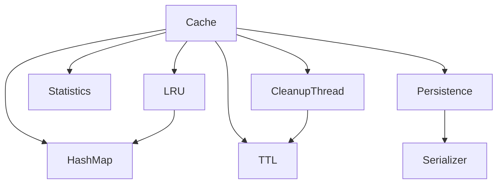

# Project 2 — Concurrent In-Memory Cache

---

# 1. Development Roadmap

## Phase 1 — Project Setup

### Objectives

- Configure CMake
- Setup GitHub Actions
- Add GoogleTest
- Add Google Benchmark
- Configure compiler warnings
- Create project skeleton

### Deliverables

- Successful Debug & Release builds
- Demo application
- Test executable
- Benchmark executable

---

## Phase 2 — Core Cache

### Implement

- Cache class
- CacheEntry
- Statistics
- Configuration
- Basic API

### Operations

```cpp
set(key, value)

get(key)

erase(key)

exists(key)

clear()

size()

empty()
```

### Verification

- Correct CRUD behavior
- O(1) average operations
- Unit tests passing

---

## Phase 3 — Concurrency

### Implement

- `std::shared_mutex`
- Reader/Writer synchronization
- Thread-safe statistics
- Safe destruction
- Lock management

### Rules

- Multiple concurrent readers
- Single writer
- No deadlocks
- Minimize lock duration

### Verification

- Multi-thread stress tests
- Race detection (ThreadSanitizer)
- Correct concurrent behavior

---

## Phase 4 — TTL & LRU

### TTL

Implement

- Default TTL
- Custom TTL
- Expiration checks
- Refresh TTL
- Lazy expiration

### Background Cleanup

Responsibilities

- Remove expired entries
- Sleep between scans
- Graceful shutdown

### LRU

Implement

- Doubly-linked list
- Touch on access
- Capacity eviction
- Constant-time updates

Verification

- Expiration accuracy
- Correct eviction order
- Capacity enforcement

---

## Phase 5 — Persistence

### Snapshot

Implement

```
save()

load()
```

Formats

- Binary (Primary)
- JSON (Optional)

Requirements

- Versioned file format
- Validation
- Atomic save (temp file → rename)
- Backward-compatible header

Verification

- Save/Load correctness
- Corruption detection
- Large snapshot support

---

## Phase 6 — Optimization

Improve

- Lock contention
- Lookup speed
- Memory usage
- Cleanup efficiency
- Serialization speed

Profile

- perf
- Valgrind
- Callgrind
- Heaptrack

---

# 2. Dependency Graph



---

# 3. Benchmarks

## Cache Operations

Measure

- SET/sec
- GET/sec
- DELETE/sec
- EXISTS/sec
- Mixed workload
- Latency (P50/P95/P99)
- Memory usage

---

## Workloads

### Read Heavy

```
95% GET

5% SET
```

### Balanced

```
50% GET

50% SET
```

### Write Heavy

```
80% SET

20% GET
```

### Random Keys

- Uniform distribution
- Large key space

### Sequential Keys

- Incremental IDs

---

## Thread Scaling

Run with

```
1

2

4

8

16

32 threads
```

Measure

- Throughput
- Lock contention
- CPU utilization
- Scalability

---

# 4. Testing Strategy

## Unit Tests

- Cache API
- TTL
- LRU
- Persistence
- Statistics
- Configuration
- Cleanup thread

Coverage Goal

> 90%

---

## Integration Tests

- CRUD operations
- Capacity limit
- Eviction correctness
- Snapshot save/load
- Multi-thread access
- Auto cleanup
- Configuration loading

---

## Stress Tests

- 100M operations
- Millions of keys
- High contention
- Long-running execution
- Frequent snapshots

---

## Failure Tests

- Missing snapshot
- Corrupted snapshot
- Invalid configuration
- Capacity = 0
- Expired entries
- Thread interruption

---

# 5. Coding Standards

General

- C++20/23
- RAII
- Const correctness
- `constexpr`
- `noexcept` where applicable
- Exception-safe APIs

Naming

```
ClassName

function_name()

variable_name

m_member

kConstant

ENUM_VALUE
```

Rules

- Small cohesive classes
- Prefer STL algorithms
- Avoid duplicated logic
- Separate interface from implementation
- Favor composition

---

# 6. Performance Guidelines

Complexities

| Operation | Target |
|-----------|--------|
| GET | O(1) |
| SET | O(1) |
| DELETE | O(1) |
| EXISTS | O(1) |
| LRU Update | O(1) |
| TTL Check | O(1) |

Optimization Goals

- Minimize mutex contention
- Avoid unnecessary allocations
- Reuse memory where practical
- Reserve container capacity
- Favor move semantics

---

# 7. Security & Reliability

Protect Against

- Invalid snapshots
- Integer overflow
- Path traversal
- Corrupted metadata
- Resource leaks

Requirements

- Snapshot validation
- Strong exception safety
- Graceful shutdown
- Consistent recovery

---

# 8. Documentation

Repository must include

```
README

Architecture

API Reference

Examples

Benchmarks

Configuration Guide

Persistence Format
```

Every public API documents

- Purpose
- Parameters
- Return value
- Complexity
- Thread-safety
- Exceptions

---

# 9. CI/CD

GitHub Actions Pipeline

```text
Checkout

↓

Configure

↓

Build

↓

Unit Tests

↓

Sanitizers

↓

Benchmarks

↓

Package
```

Compilers

- GCC
- Clang

Configurations

- Debug
- Release

Sanitizers

- AddressSanitizer
- UndefinedBehaviorSanitizer
- ThreadSanitizer (Linux)

---

# 10. Definition of Done

Core Cache

- Thread-safe CRUD
- O(1) average operations
- Correct synchronization
- Clean shutdown

TTL

- Expiration works
- Cleanup thread stable
- No stale entries

LRU

- Correct eviction order
- Capacity respected
- Constant-time updates

Persistence

- Save works
- Load works
- Validation implemented
- Corruption handled safely

Quality

- Unit tests pass
- Benchmarks completed
- No memory leaks
- No data races
- Documentation complete

---

# 11. Stretch Goals

- Redis-compatible RESP server
- TCP networking
- Write-Ahead Log (WAL)
- Incremental snapshots
- LFU eviction
- ARC eviction
- Memory pools
- Lock-free cache
- NUMA-aware allocation
- Custom allocator
- Compression
- Sharding
- Replication

---

# 12. AI Implementation Instructions (Codex / Claude Code)

## General Rules

- Generate production-ready C++20/23 only.
- No placeholder or stub implementations.
- Separate headers and source files.
- Keep modules loosely coupled and cohesive.
- Use RAII exclusively.
- Avoid global mutable state.
- Public APIs must be thread-safe where applicable.
- Critical operations should target O(1) average complexity.
- Minimize lock scope and contention.
- Use `std::shared_mutex` for read-heavy workloads.
- Prefer `std::string_view`, move semantics, and standard library facilities.
- Ensure deterministic destruction of background threads.
- Keep serialization format versioned and extensible.

## Code Quality

- Compile cleanly with `-Wall -Wextra -Wpedantic -Werror`.
- Pass `clang-tidy`.
- Pass AddressSanitizer, UndefinedBehaviorSanitizer, and ThreadSanitizer.
- No memory leaks, undefined behavior, or data races.

## Performance Expectations

- Avoid unnecessary copies.
- Avoid repeated hash lookups where possible.
- Reserve container capacity when appropriate.
- Snapshot loading should stream efficiently.
- Background cleanup should have minimal impact on foreground latency.

## Deliverables

- CMake project
- Static and shared library
- Demo CLI
- Unit tests
- Benchmarks
- Documentation
- Example configuration
- Example snapshots
- GitHub Actions workflow

---

**End of Project 2 Specification**