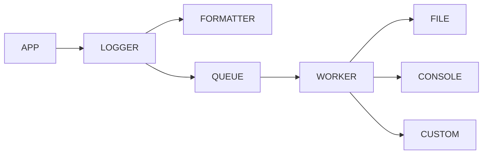
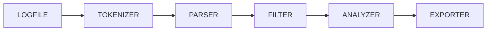
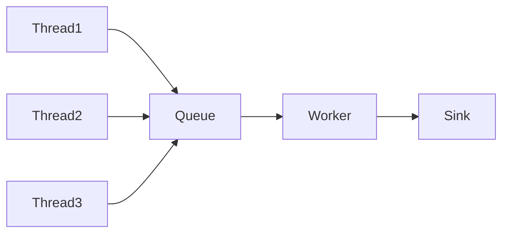

# Project 1 — High Performance Asynchronous Logger & Log Parser

> **Language:** C++20/23
> **Build:** CMake
> **Platforms:** Linux (Primary), Windows (Secondary)
> **Type:** Static/Shared Library + CLI Applications
> **Target:** Production-quality logging library inspired by spdlog/glog with integrated log parser.

---

# 1. Overview

A modular, high-performance logging framework designed for low-latency applications. The project consists of:

- Logging Library (`liblogger`)
- Log Parser CLI (`logparser`)
- Benchmark Suite
- Unit Tests

Goals:

- High throughput
- Thread-safe
- Minimal allocations
- Modular sink architecture
- Structured logging
- Easy integration
- Extensible parser

---

# 2. Features

## Logger

- TRACE/DEBUG/INFO/WARN/ERROR/FATAL
- Colored console output
- File logging
- Multiple sinks
- Async logging
- Sync logging
- Log rotation
- Custom formatter
- Timestamp
- Thread ID
- Process ID
- Source Location
- Exception logging
- Binary data dump
- Flush API
- Runtime configuration

## Parser

- Parse log files
- Filter by level
- Filter by date
- Filter by thread
- Filter by module
- Keyword search
- Regex search
- Statistics
- Top errors
- Export CSV
- Export JSON

---

# 3. Non Goals

- Remote logging
- GUI
- Database storage
- Network transport
- Distributed logging
- Cloud integrations

---

# 4. Technology Stack

| Component | Technology |
|------------|------------|
| Language | C++20/23 |
| Build | CMake |
| Tests | GoogleTest |
| Benchmark | Google Benchmark |
| Formatting | fmt |
| JSON | nlohmann/json |
| Regex | STL |
| Threading | std::thread |
| Time | chrono |
| Filesystem | std::filesystem |

---

# 5. Project Layout

```text
logger/

├── CMakeLists.txt
├── README.md

├── include/
│   └── logger/
│       ├── logger.hpp
│       ├── sink.hpp
│       ├── formatter.hpp
│       ├── async_logger.hpp
│       ├── config.hpp
│       ├── level.hpp
│       └── macros.hpp

├── src/
│   ├── logger.cpp
│   ├── formatter.cpp
│   ├── async_logger.cpp
│   ├── sink.cpp
│   ├── queue.cpp
│   ├── config.cpp
│   └── parser.cpp

├── apps/
│   ├── logger_demo.cpp
│   └── logparser.cpp

├── benchmarks/

├── tests/

├── docs/

└── logs/
```

---

# 6. High-Level Architecture



---

# 7. Parser Architecture



---

# 8. Logger Pipeline

```
Application

↓

LOG_INFO()

↓

Logger

↓

Formatter

↓

Log Message

↓

Async Queue

↓

Worker Thread

↓

Sink

↓

Console / File
```

---

# 9. Core Components

## Logger

Responsibilities

- Receive messages
- Level filtering
- Build log record
- Dispatch

Public API

```cpp
trace()

debug()

info()

warn()

error()

fatal()

flush()
```

---

## Formatter

Responsibilities

- Format timestamp
- Format level
- Format thread id
- Format message

Pattern example

```
[%Y-%m-%d %H:%M:%S]

[%L]

[T%t]

%m
```

Example output

```
2026-07-20 20:10:30

INFO

T7

Server Started
```

---

## Queue

Responsibilities

- Buffer messages
- Lock-free if possible
- Bounded queue
- Backpressure

Operations

```
push()

pop()

empty()

size()
```

---

## Worker

Dedicated background thread

Responsibilities

- Pop queue
- Write sinks
- Flush
- Shutdown safely

---

## Sink

Abstract base class

Derived

```
ConsoleSink

FileSink

RotatingFileSink

NullSink

CustomSink
```

---

## Parser

Responsibilities

- Read file
- Tokenize
- Build record
- Apply filters
- Produce report

---

# 10. Log Record Structure

```cpp
struct LogRecord
{
    Timestamp
    Level
    ThreadId
    ProcessId
    File
    Function
    Line
    Message
}
```

---

# 11. Thread Model



Rules

- Multiple producers
- Single consumer
- Worker owns sinks
- Producers never touch files

---

# 12. Memory Ownership

| Object | Owner |
|---------|------|
| Logger | Application |
| Queue | Logger |
| Worker | Logger |
| Formatter | Logger |
| Sink | Logger |
| LogRecord | Queue until consumed |

Guidelines

- RAII only
- No raw owning pointers
- std::unique_ptr preferred
- std::shared_ptr only when required
- Avoid heap allocation on hot path

---

# 13. Configuration

Example

```json
{
    "async": true,
    "level": "INFO",
    "flush_interval": 2,
    "queue_size": 65536,
    "pattern": "[%T] [%L] %m",
    "file": "logs/app.log"
}
```

Runtime configurable

- Level
- Pattern
- Queue size
- Rotation size
- Sink enable/disable

---

# 14. CLI (Parser)

```
logparser app.log
```

Examples

```bash
logparser app.log

logparser app.log --level ERROR

logparser app.log --thread 7

logparser app.log --keyword socket

logparser app.log --regex timeout.*

logparser app.log --stats

logparser app.log --csv out.csv

logparser app.log --json out.json
```

---

# 15. Performance Targets

Logger

- >1,000,000 logs/sec
- <10µs average latency
- Minimal allocations
- Zero allocations on steady-state hot path

Parser

- >200 MB/s parsing
- Streaming parser
- O(n) complexity
- Constant memory when possible

---

# 16. Error Handling

Recoverable

- File missing
- Permission denied
- Invalid config

Fatal

- Queue corruption
- Formatter failure
- Memory exhaustion (where unrecoverable)

Rules

- Never crash due to logging failure.
- Logging failures must not terminate the application.
- Parser errors should report line numbers and continue when possible.

---

# 17. Coding Guidelines

- Modern C++ only
- RAII everywhere
- `constexpr` where appropriate
- `enum class`
- `std::string_view`
- `std::span`
- Avoid macros except logging macros
- No global mutable state
- Exception-safe APIs
- Keep interfaces small and cohesive
- Favor composition over inheritance (except Sink hierarchy)

---

# 18. Future Extensions

- TCP sink
- UDP sink
- Syslog sink
- JSON logger
- Binary logger
- Compression
- Log replay
- Live log tailing
- Metrics dashboard
- OpenTelemetry integration

---

# Part 2 (`LOGGER_IMPLEMENTATION.md`) will contain:
- Complete implementation roadmap (Phase 1–6)
- Class dependency graph
- Benchmark suite design
- Testing strategy
- CI/CD pipeline
- AI implementation instructions for Codex/Claude Code
- Definition of Done
- Stretch goals