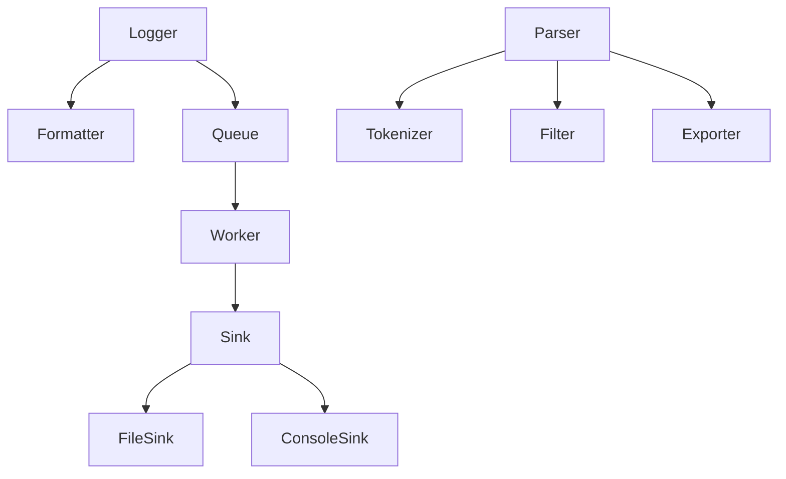

# Project 1 — High Performance Asynchronous Logger & Log Parser

---

# 1. Development Roadmap

## Phase 1 — Foundation

### Objectives
- Setup repository
- Configure CMake
- Configure compiler warnings
- Setup CI
- Add formatting/linting
- Create project skeleton

### Deliverables
- Build succeeds
- Unit test framework
- Benchmark framework
- Demo application

---

## Phase 2 — Core Logger

### Implement

- Log levels
- Logger singleton/factory
- LogRecord
- Formatter
- Pattern parser
- Console sink
- File sink
- Logging macros

Example

```cpp
LOG_INFO("Application Started");

LOG_WARN("Low Memory");

LOG_ERROR("Socket Failed");
```

### Verification

- Console output
- File output
- Correct formatting
- Level filtering

---

## Phase 3 — Asynchronous Logging

### Implement

- Bounded queue
- Worker thread
- Graceful shutdown
- Flush API
- Queue overflow policy

Overflow Policies

- Block
- Drop newest
- Drop oldest
- Discard all

Queue Lifecycle

```text
Producer

↓

Push Queue

↓

Worker

↓

Sink

↓

Flush
```

Verification

- Multi-thread tests
- No deadlocks
- No memory leaks
- Correct shutdown

---

## Phase 4 — Advanced Features

### Log Rotation

Policies

- Max file size
- Max files
- Daily rotation

### Multiple Sinks

Example

```
Console

+

File

+

Custom Sink
```

### Structured Logging

```cpp
LOG_INFO(
    "Connected",
    {
        {"ip","192.168.0.10"},
        {"port",8080}
    }
);
```

### Runtime Configuration

Reload config without restart.

---

## Phase 5 — Log Parser

### Parsing Pipeline

```text
Read File

↓

Tokenizer

↓

Record Builder

↓

Filter Engine

↓

Statistics

↓

Exporter
```

### Parser Features

- Parse line-by-line
- Detect malformed entries
- Continue after parse errors
- Large file support

Filters

```
--level

--thread

--module

--date

--keyword

--regex
```

Statistics

- Total logs
- Count per level
- Top threads
- Top modules
- Errors/hour
- Warnings/hour

Export

- CSV
- JSON
- Plain text

---

## Phase 6 — Optimization

### Improve

- Throughput
- Memory usage
- Startup time
- Formatter speed
- Parser speed

Profile

- perf
- Valgrind
- Callgrind
- Heaptrack

---

# 2. Dependency Graph



---

# 3. Benchmarks

## Logger

Measure

- Logs/sec
- Latency
- Queue utilization
- Memory usage
- CPU usage

Scenarios

### Single Thread

1M log entries

### Multi Thread

1

2

4

8

16

32 threads

### File Logging

SSD

Large files

Rotation enabled

### Console Logging

Enabled

Disabled

---

## Parser

Measure

- MB/sec
- Records/sec
- Peak memory
- Regex performance
- Filter performance

Datasets

10 MB

100 MB

1 GB

10 GB

---

# 4. Testing Strategy

## Unit Tests

Logger

Formatter

Queue

Worker

Sink

Parser

Filters

Exporter

Coverage Goal

> 90%

---

## Integration Tests

- Console logging
- File logging
- Rotation
- Async mode
- Config loading
- CLI parser
- CSV export
- JSON export

---

## Stress Tests

- 100M log messages
- 32 producer threads
- Large files
- Queue overflow
- Forced shutdown

---

## Failure Tests

Disk full

Permission denied

Broken config

Corrupted log

Regex failure

---

# 5. Coding Standards

General

- C++20/23
- RAII
- const correctness
- noexcept where applicable
- constexpr when possible

Naming

```
ClassName

function_name()

variable_name

m_member

kConstant

ENUM_VALUE
```

Rules

- No code duplication
- Small functions
- Single responsibility
- Prefer STL
- Avoid macros except logging API
- Minimize dynamic allocation

---

# 6. Performance Guidelines

Target

```
Console

>500K logs/sec

File

>1M logs/sec

Parser

>200 MB/sec
```

Avoid

- String copies
- Heap allocations
- Mutex contention
- Blocking producers

Prefer

- string_view
- move semantics
- reserve()
- emplace_back()

---

# 7. Security Considerations

Prevent

- Buffer overflow
- Format-string misuse
- Path traversal
- Invalid UTF-8 crashes

Sanitize

- File paths
- Config input
- Parser input
- Regex patterns

---

# 8. Documentation

Repository must contain

```
README

Architecture

Examples

Benchmarks

API Reference

Contributing
```

Every public API requires

- Description
- Parameters
- Return value
- Exceptions
- Complexity

---

# 9. CI/CD

GitHub Actions

Stages

```
Build

↓

Unit Tests

↓

Sanitizers

↓

Benchmarks

↓

Package
```

Compilers

- GCC
- Clang

Build Types

- Debug
- Release

Run

- AddressSanitizer
- UndefinedBehaviorSanitizer
- ThreadSanitizer (Linux)

---

# 10. Definition of Done

Logger

- Sync logging works
- Async logging works
- Rotation works
- Multiple sinks work
- Config loading works
- Formatter configurable
- No memory leaks
- No deadlocks
- Unit tests pass
- Benchmarks completed

Parser

- Reads large files
- Filtering works
- Regex works
- Statistics correct
- CSV export
- JSON export
- Invalid logs handled
- Streaming parser
- Tests pass

---

# 11. Stretch Goals

- Lock-free MPMC queue
- Binary log format
- Memory-mapped log reader
- Live log tail
- HTTP dashboard
- Remote TCP/UDP sink
- OpenTelemetry exporter
- Compression (gzip/zstd)
- Plugin sink API
- Dynamic formatter plugins

---

# 12. AI Implementation Instructions (Codex / Claude Code)

## General Rules

- Produce production-quality code only.
- Do not generate placeholder implementations.
- Keep headers and source files separate.
- Prefer composition over inheritance.
- Use modern C++20/23 idioms.
- Use RAII exclusively for resource management.
- Avoid global mutable state.
- Minimize heap allocations on the logging hot path.
- Favor `std::string_view`, move semantics, and `std::span` where appropriate.
- Make public APIs exception-safe and thread-safe when required.
- Ensure deterministic shutdown of worker threads.
- Follow SOLID principles where they improve maintainability.
- Use `std::filesystem`, `std::chrono`, and standard concurrency primitives unless a clear performance benefit justifies an alternative.
- Every module should compile independently and expose a minimal public interface.

## Code Quality

- Warning-free with `-Wall -Wextra -Wpedantic -Werror`.
- Pass `clang-tidy`.
- Pass AddressSanitizer and UndefinedBehaviorSanitizer.
- No memory leaks or data races.
- Maintain clear separation between logging library, parser, benchmarks, tests, and demo applications.

## Performance Expectations

- Logging path should avoid unnecessary allocations and string copies.
- Parser should process files in a streaming manner instead of loading the entire file into memory.
- Critical operations should target O(1) or amortized O(1) where applicable.
- Profile before introducing micro-optimizations.

## Deliverables

- CMake project
- Static and shared library targets
- Demo application
- Parser CLI
- Unit tests
- Benchmarks
- Complete documentation
- Example configuration files
- Sample log files
- GitHub Actions workflow

---

**End of Project 1 Specification**